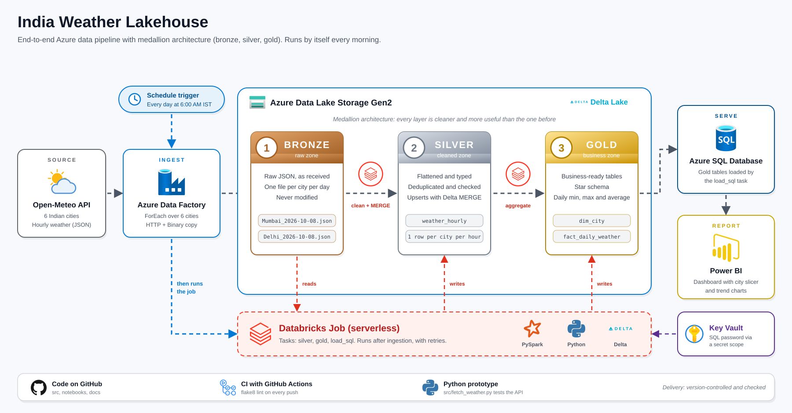

# India Weather Lakehouse (Azure Data Engineering Project)

An automated, end-to-end data pipeline on Azure. Every day it pulls hourly weather data for 6 Indian cities from the Open-Meteo API, cleans it with PySpark, builds analytics tables and serves them to a Power BI dashboard.



## Architecture

Open-Meteo API -> Azure Data Factory -> ADLS Gen2 (bronze) -> Databricks (silver, gold) -> Azure SQL Database -> Power BI

- **Orchestration:** Azure Data Factory, scheduled daily at 6:00 AM IST. A ForEach loop calls the API once per city, then triggers a Databricks job.
- **Bronze:** raw JSON files, one per city per day, stored unchanged in ADLS Gen2.
- **Silver:** cleaned hourly table in Delta format. Deduplicated, typed, quality-checked and loaded incrementally with MERGE.
- **Gold:** star schema with `dim_city` and `fact_daily_weather` (daily min, max and average temperature, humidity, rainfall and wind).
- **Serving:** gold tables loaded into Azure SQL Database, read by Power BI.

## Tech stack

Azure Data Factory, ADLS Gen2, Azure Databricks (serverless), PySpark, Delta Lake, Unity Catalog, Azure SQL Database, Azure Key Vault, Power BI, GitHub Actions, Python.

## Design decisions

- **Medallion architecture:** raw data is kept in bronze, so any bug in the cleaning logic can be fixed and reprocessed without calling the API again.
- **Idempotent loads:** the silver step uses a Delta MERGE on (city, reading time), so reruns never create duplicates.
- **No secrets in code:** Databricks reaches storage through a managed identity and Unity Catalog external locations. The SQL password is stored in Azure Key Vault and read through a secret scope.
- **HTTP connector instead of REST:** the Data Factory REST connector failed to decode the API response (error 23360), so the HTTP connector with a Binary dataset lands the raw file untouched.
- **Serverless compute:** the pipeline triggers a Databricks Job from Data Factory, because the workspace has no classic clusters.
- **Data quality:** the silver notebook fails the run if temperatures are outside a plausible range.
- **Retries:** the SQL load task retries because the free-tier database auto-pauses.

## Repository structure

```
src/                 Python script used to prototype the API ingestion
notebooks/           Databricks notebooks: silver, gold, load to SQL
docs/                dashboard screenshot and Power BI file
.github/workflows/   CI: flake8 lint on every push
requirements.txt
```

## Limitations and next steps

- Deployment to Azure is manual. Next step: Databricks Git folders and Asset Bundles with a CD workflow.
- Add unit tests for the transformation logic.
- Connect Data Factory to Git and add separate dev and prod environments.